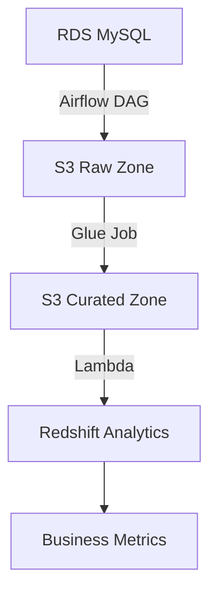

# AWS Glue with Step Functions Data Pipeline

## Overview
This project demonstrates a comprehensive data engineering pipeline using AWS Glue, Step Functions, Airflow, and Redshift. It includes:
- Real estate data ETL from RDS to S3
- Chess game data pipeline
- Scheduled analytics with Redshift
- Data quality monitoring

## Architecture


## Components

### 1. Real Estate Pipeline
**DAG**: `dags/real_estate.py`
- Extracts data from RDS MySQL
- Performs data quality checks
- Creates optimized indexes
- Transforms and loads to S3 in Parquet format
- Verifies successful uploads

### 2. Chess Data Pipeline
**Script**: `chess_pipeline.py`
- Extracts chess player data from public APIs
- Loads to filesystem in structured format
- Tracks player games and online status

### 3. Analytics Lambda
**Script**: `python/lambda.py`
- Calculates key business metrics:
  - Weekly average listing prices
  - Monthly occupancy rates
  - Popular locations
  - Customer retention rates
- Stores results in Redshift presentation layer

## Data Schemas

### Raw Data (RDS)
```sql
-- See raw_schema.sql
CREATE TABLE raw_data.raw_apartments (...);
CREATE TABLE raw_data.raw_bookings (...);
```

### Curated Data (S3)
```sql
-- See curated_schema.sql
CREATE TABLE curated.apartments (...);
CREATE TABLE curated.bookings (...);
```

## Setup

1. **Prerequisites**:
   - AWS Account with Glue, Redshift, Lambda access
   - Airflow environment
   - Python 3.8+

2. **Installation**:
   ```bash
   pip install -r requirements.txt
   ```

3. **Configuration**:
   - Set environment variables in `airflow_settings.yaml`
   - Configure AWS credentials

## Usage

1. **Run Airflow DAG**:
   ```bash
   airflow dags trigger Getting-data-from-RDS-and-uploading-to-S3
   ```

2. **Manual Chess Pipeline**:
   ```python
   python chess_pipeline.py
   ```

3. **Lambda Invocation**:
   - Configure as daily CloudWatch Event
   - Or test via AWS Console

## Monitoring
- Airflow UI for pipeline status
- CloudWatch logs for Lambda executions
- Redshift queries for analytics

## License
Apache 2.0 - See LICENSE file
